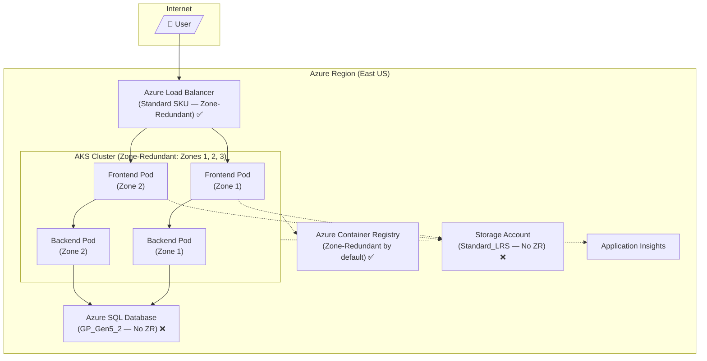
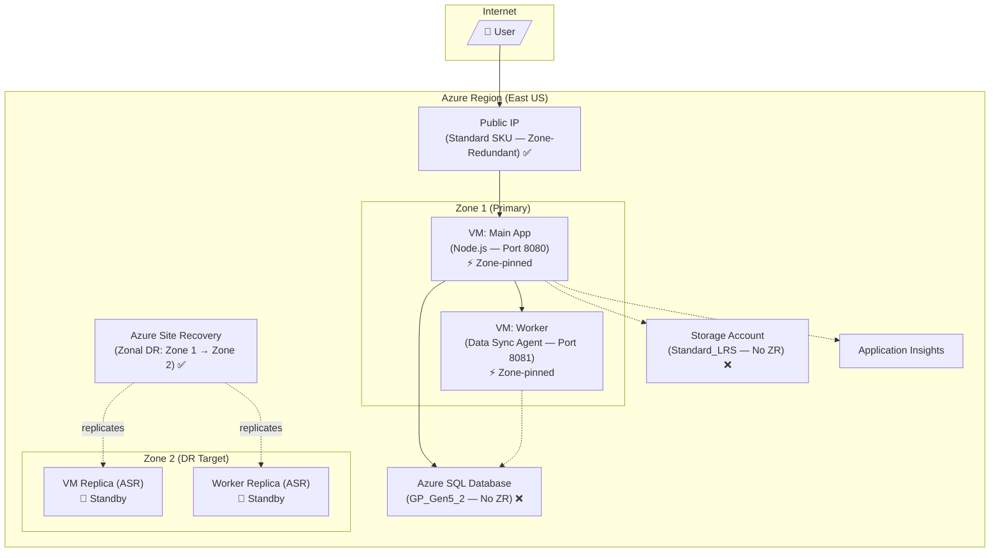

# Infrastructure Resiliency Manager — Field Demo Guide

> **Two sample applications deployed to Azure for demonstrating Infrastructure Resiliency Manager (IRM) capabilities to customers.**

This repository contains the source code, infrastructure-as-code, and demo guide for two live applications designed to showcase the end-to-end journey of assessing, remediating, and validating zone resiliency using Infrastructure Resiliency Manager.

---

## Quick Reference

| Item | Value |
|---|---|
| **AKS App URL** | http://irm-demo-aks.westus2.cloudapp.azure.com |
| **VM App URL** | http://irm-demo-vm.westus2.cloudapp.azure.com:8080 |
| **AKS Service Group** | `IRMDemoSG2` |
| **VM Service Group** | `IRMDemoSG3` |
| **AKS Resource Group** | `zr-demo-rg-4` |
| **VM Resource Group** | `zr-demo-vm-rg` |

---

## Demo Storyline: "Contoso Retail — From Blind Spots to Validated Zone Resilience"

### Act 1 — "Meet the Apps" (Architecture & Current State)

Introduce both live apps by opening them in a browser. Explain what they do and highlight the zone resiliency gaps.

---

#### App A — E-Commerce Platform (AKS Microservices)

**Live URL:** http://irm-demo-aks.westus2.cloudapp.azure.com

A microservices e-commerce app with a **frontend** (product catalog, blob storage for static assets) calling a **backend API** (order processing via Azure SQL). Container images are pulled from Azure Container Registry. Deployed on AKS with 3 nodes spread across availability zones 1, 2, and 3.



| Resource | Zone Redundancy | Status |
|---|---|---|
| AKS Cluster (3 nodes, zones 1/2/3) | **Zone-redundant** | ✅ |
| Azure Load Balancer (Standard SKU) | **Zone-redundant** | ✅ |
| Azure Container Registry | **Zone-redundant by default** | ✅ |
| Azure SQL Database (GP_Gen5_2) | **Not zone-redundant** | ❌ |
| Storage Account (Standard_LRS) | **Not zone-redundant** | ❌ |

**What it demonstrates:** The AKS compute layer *looks* resilient — nodes are spread across zones. But the backend dependencies (SQL, Storage) are not zone-redundant. A zone failure could keep compute alive while data services become unreachable.

---

#### App B — Inventory Management System (VM-based with ASR)

**Live URL:** http://irm-demo-vm.westus2.cloudapp.azure.com:8080

A monolithic inventory management app running on a **zone-pinned VM** (Zone 1) with a companion **worker VM** (data sync agent, also Zone 1). Both VMs are protected by **Azure Site Recovery** with zonal DR (Zone 1 → Zone 2), making them zone-redundant.

**The challenge** is not *if* recovery can happen, but **how to orchestrate it** — recovering VMs in the correct sequence and validating the app works end-to-end after failover.



| Resource | Zone Redundancy | Status |
|---|---|---|
| VM — Main App (Zone 1, ASR to Zone 2) | **Zone-redundant via ASR** | ✅ |
| VM — Worker (Zone 1, ASR to Zone 2) | **Zone-redundant via ASR** | ✅ |
| Public IPs (Standard SKU) | **Zone-redundant by default** | ✅ |
| Azure Site Recovery Vault | Orchestrates zonal failover | ✅ |
| Azure SQL Database (GP_Gen5_2) | **Not zone-redundant** | ❌ |
| Storage Account (Standard_LRS) | **Not zone-redundant** | ❌ |

**What it demonstrates:** The VMs *can* survive a zone failure via ASR, but orchestrating recovery under pressure — in the right order — is the real challenge. Has it ever been tested? Can we prove it works before a real outage?

---

> **Key talking point for Act 1:** "The AKS app looks resilient on the surface — nodes are across zones. But what about the SQL database and storage it depends on? The VM app has ASR configured, so it *can* survive a zone outage — but can the customer actually orchestrate the recovery in the right order under pressure? Has it ever been tested? These are the questions Infrastructure Resiliency Manager answers."

---

### Act 2 — "Discover Your Posture at Scale" (Infrastructure Resiliency Manager — Assessment)

> **Pre-created service groups are ready for demo:**
> | Service Group | App | What's configured |
> |---|---|---|
> | **IRMDemoSG2** | AKS-based e-commerce app | Goals + Drill |
> | **IRMDemoSG3** | VM-based inventory app | Goals + Recovery Plan + Drill |

#### Step 1: Start from the At-Scale View

1. Open the **Infrastructure Resiliency Manager** portal
2. Navigate to **Resiliency → Resiliency Overview**
3. Show the **at-scale summary** across all service groups:
   - Zone-resilient vs. non-resilient service groups
   - Total resource count broken down by posture
   
   > *"This is what a platform team sees when managing dozens of applications — one pane of glass showing which apps meet zone resilience goals and which don't."*

#### Step 2: Drill into IRMDemoSG2 (AKS App)

1. Click on the non-resilient service groups tile → select **IRMDemoSG2**
2. Show the per-resource breakdown:
   - ✅ AKS Cluster, Load Balancer → Zone-resilient
   - ❌ SQL Database, Storage Account → Non zone-resilient
3. Show recommendations auto-generated for each non-resilient resource, including:
   - What needs to change
   - Qualitative cost indicator (Low/Medium/High)

#### Step 3: Drill into IRMDemoSG3 (VM App)

1. Navigate back and select **IRMDemoSG3**
2. Show the per-resource breakdown:
   - ✅ VMs with ASR configured → Zone-resilient
   - ❌ SQL Database, Storage → Non zone-resilient
3. Note the **Recovery Plan** already associated for orchestrated failover

#### Step 4: Review Recommendations

For each non-resilient resource, show:
- Step-by-step remediation guidance
- Copilot-powered **"Resolve"** feature that generates ready-to-run scripts

> **Key talking point:** "Without this tool, you'd need to manually inspect each resource's zone configuration. With Infrastructure Resiliency Manager, you get a single aggregated view, actionable recommendations with cost implications, and Copilot-generated remediation scripts."

---

### Act 3 — "Close the Gaps" (Remediation Guidance)

Walk through how to address the recommendations surfaced in Act 2:

| Resource | Recommendation | Cost Impact | Effort |
|---|---|---|---|
| **Azure SQL Database** (both apps) | Enable zone redundancy | Medium | Low — portal toggle, brief disconnect |
| **Storage Accounts** (both apps) | Convert LRS → ZRS | Low | Medium — may require support request |


**Demo the Copilot "Resolve" feature:**
1. Select a SQL Database recommendation
2. Click "Resolve" to open the Copilot agent
3. Copilot guides the user step by step to understand:
   - What can be **fixed in place** (e.g., portal toggle to enable zone redundancy)
   - What needs to be **redeployed via script or automation** (e.g., storage account LRS → ZRS conversion)
   - What requires **manual effort** (e.g., architecture changes, support requests)
4. The user can also prompt the agent to generate an **IaC template** (Bicep) with the right resiliency controls already enabled — ready to deploy or integrate into existing pipelines.

> **Key talking point:** "Infrastructure Resiliency Manager doesn't just tell you what's wrong — Copilot walks you through each fix, categorizes the effort, and can even generate deployment-ready IaC templates with zone-redundancy baked in."

---

### Act 4 — "Prove It Works" (Zone Down Drills)

The most impactful part of the demo — actually simulating a zone failure and validating recovery.

---

#### Drill: AKS App (IRMDemoSG2)

**Goal:** Prove that the AKS compute layer survives a zone failure.

1. Navigate to **IRMDemoSG2 → Resiliency → Drills** (drill already created)
2. In the **Fault Designer**, note that:
   - ✅ **AKS Cluster** is included for fault injection (node shutdown in target zone)
   - ⛔ **SQL Database** is **excluded** from the drill (it's non-ZR and would cause expected failures — we're focused on validating what *is* resilient)
3. **Execute the drill** targeting Zone 1:
   - AKS node pool VMs in Zone 1 get shut down via Chaos Studio
   - The Load Balancer detects unhealthy nodes and routes traffic to zones 2 and 3
4. **Open the app** at http://irm-demo-aks.westus2.cloudapp.azure.com — it continues serving because AKS has nodes in other zones. Frontend and backend pods reschedule automatically.
5. **Monitor metrics** during the drill — view per-resource health in the drill execution job
6. **End the drill** — nodes come back, pods rebalance across all zones

> **Key talking point:** "We excluded the non-resilient SQL DB and focused on validating what we know should survive. The app stayed up because AKS compute is zone-redundant. Next step: make SQL zone-redundant too, then run the full drill."

---

#### Drill: VM App (IRMDemoSG3)

**Goal:** Prove that the orchestrated recovery plan brings the app back in the correct sequence.

1. Navigate to **IRMDemoSG3 → Resiliency → Drills** (drill + recovery plan pre-created)
2. **Execute the drill** targeting Zone 1:
   - The VM fault shuts down both VMs in Zone 1
   - **App goes dark** — http://irm-demo-vm.westus2.cloudapp.azure.com:8080 is completely unreachable
3. **Execute the pre-created Recovery Plan** (orchestrated sequence):
   - The recovery plan recovers VMs in the defined order:
     1. **First:** Worker VM fails over to Zone 2 (data sync agent must be ready before the main app)
     2. **Then:** Main App VM fails over to Zone 2 (depends on worker being available)
   - ASR handles disk replication, IP reassignment, and VM boot in Zone 2
4. **Validate recovery** — The app comes up on the new IP in Zone 2. Check the health endpoint to confirm connectivity to SQL and storage.
5. After validation, **Reprotect** (Zone 2 → Zone 1) to restore the original configuration for future drills.

> **Key talking point:** "This is what makes drills invaluable for VM workloads. ASR gives you the *capability* to recover, but without a tested, orchestrated recovery plan, you're guessing at sequencing under pressure during a real outage. The pre-built recovery plan ensures VMs come up in the right order, every time. And metrics during the drill tell you exactly how long recovery took — your measured RTO."

---

## Summary: The Customer Journey

| Demo Act | IRM Capability | Customer Value |
|---|---|---|
| **Act 1** — Meet the Apps | Architecture awareness | Understand what you have |
| **Act 2** — Discover Posture | At-Scale View → Service Group Posture | Single pane of glass across all apps |
| **Act 3** — Close Gaps | Recommendations + Copilot Scripts | Prioritized, actionable remediation |
| **Act 4a** — AKS Drill | Zone Down Fault Injection | Validated that zone-spread compute works |
| **Act 4b** — VM Drill | Orchestrated Recovery Plan | Proven sequenced recovery, measured RTO |

---

## Repository Structure

```
├── apps/
│   ├── scenario4-frontend/     # AKS frontend (Express.js + Blob Storage)
│   ├── scenario4-backend/      # AKS backend (Express.js + Azure SQL)
│   ├── scenario6-vm-zonal/     # VM main app (Express.js + SQL + Storage)
│   └── scenario6-vm-worker/    # VM worker (data sync agent)
├── infra/
│   ├── scenario4-aks/          # Bicep: AKS + SQL + Storage + ACR
│   ├── scenario6-vm-zonal/     # Bicep: VMs + ASR + SQL + Storage
│   └── modules/                # Shared Bicep modules
├── scripts/
│   ├── deploy-scenario.sh      # Deploy a specific scenario
│   └── load-gen/               # Load testing scripts (k6)
└── docs/
    ├── architecture.md
    ├── scenarios.md
    └── deployment-guide.md
```

---

## Environment Setup & Deployment

For full deployment instructions, prerequisites (including storage account key configuration), and scenario details, see **[setup-readme.md](setup-readme.md)**.

---

## Additional Resources

- Support: [azureresiliency@microsoft.com](azureresiliency@microsoft.com)
