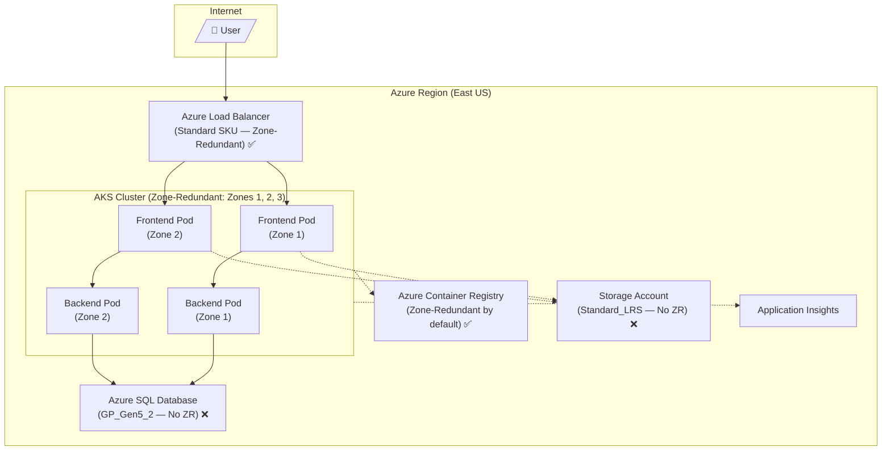
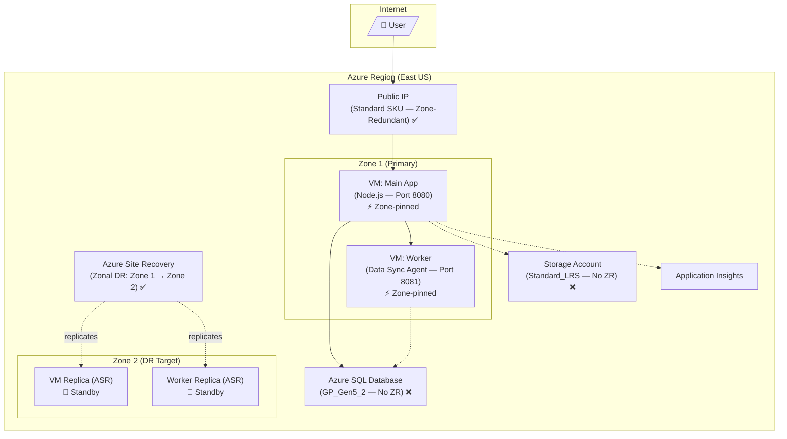

# Infrastructure Resiliency Manager — Field Demo Guide

> **Two sample applications deployed to Azure for demonstrating Infrastructure Resiliency Manager (IRM) capabilities to customers.**

This repository contains the source code, infrastructure-as-code, and demo guide for two live applications designed to showcase the three customer journeys of Azure infrastructure resiliency: **Start Resilient**, **Get Resilient**, and **Stay Resilient**.

---

## Quick Reference

| Item | Value |
|---|---|
| **AKS App URL** | http://irm-demo-aks.westus2.cloudapp.azure.com |
| **VM App URL** | http://zr-inventory-asr.westus2.cloudapp.azure.com |
| **AKS Service Group** | `IRMDemoSG5` |
| **VM Service Group** | `IRMDemoSG8` |
| **AKS Resource Group** | `zr-demo-rg-4` |
| **VM Resource Group** | `zr-demo-vm-asr-rg` |

---

## Demo Storyline: "Contoso Retail — Three Customer Journeys to Zone Resilience"

> **Positioning:** Don't lead with the console — lead with the customer's resiliency moment. Every customer is living in one of three states: deploying something new (Start), hardening what already exists (Get), or keeping a resilient estate from drifting (Stay). The Resiliency Agent and Infrastructure Resiliency Manager meet them wherever they are.

### Phase 1 — "Start Resilient" (Resilient by Default)

> *"Help me get started with resiliency by default."*

**Customer moment:** Greenfield deployment. The customer is designing a new application or modernizing an existing one. They want to get the architecture right from the outset — not retrofit resilience later.

**What to show:** The **Resiliency Agent** (Azure Copilot) generates a guidance report and deployment-ready IaC templates with zone-redundancy baked in, before a single resource is deployed.

#### Demo Flow: Agent-Led Template Generation

1. Open the **Resiliency Agent** (Azure Copilot → Resiliency)
2. Describe the application requirements. Example prompt:

   > *"I need to deploy an e-commerce application on AKS in West US 2 with a SQL database for order processing and a storage account for product images. Generate zone-resilient Bicep templates."*

3. **The agent responds with:**
   - A **guidance report** — which services need zone redundancy and what configurations to set
   - Modular **Bicep templates** with zone-redundancy baked in:
     - AKS cluster with zone-redundant node pools across zones 1, 2, 3
     - Azure SQL Database with zone redundancy enabled
     - Storage Account configured as ZRS (Zone-Redundant Storage)
     - Standard Load Balancer with zone-redundant frontend
   - Cost implications and trade-offs for each resilience choice

4. **Show the generated templates** — the customer leaves with deployment-ready IaC, not a list of recommendations

> **Key talking point:** "The proof point is that you leave this conversation with deployable, resilient-by-default infrastructure-as-code in the tooling you already use — Bicep, Terraform, or ARM templates. Not a list of recommendations to figure out later."

**Why this matters:** Many organizations still use IaC templates that were written before availability zones existed. The Resiliency Agent ensures that new deployments start with the right configuration from day zero — eliminating the need for costly re-architecture later.

---

### Phase 2 — "Get Resilient" (Find What Is Critical)

> *"Years of apps on Azure — what is actually critical?"*

**Customer moment:** Brownfield estate. The customer has dozens or hundreds of applications already running in Azure. They need to understand which are truly zone-resilient and which have hidden gaps — then close those gaps efficiently.

**What to show:** Use **Infrastructure Resiliency Manager** to assess posture at scale, drill into specific applications, and use Copilot-powered remediation to close gaps.

---

#### Step 1: Meet the Apps (Architecture & Current State)

Introduce both live apps by opening them in a browser. Explain what they do and highlight the zone resiliency gaps.

##### App A — E-Commerce Platform (AKS Microservices)

**Live URL:** http://irm-demo-aks.westus2.cloudapp.azure.com

A microservices e-commerce app with a **frontend** (product catalog, blob storage for static assets) calling a **backend API** (order processing via Azure SQL). Container images are pulled from Azure Container Registry. Deployed on AKS with 3 nodes spread across availability zones 1, 2, and 3.


```mermaid
graph TB
    subgraph Internet
        User[/"👤 User"/]
    end

    subgraph Azure["Azure Region (East US)"]
        subgraph AKS["AKS Cluster (Zone-Redundant: Zones 1, 2, 3)"]
            direction TB
            FE1["Frontend Pod\n(Zone 1)"]
            FE2["Frontend Pod\n(Zone 2)"]
            BE1["Backend Pod\n(Zone 1)"]
            BE2["Backend Pod\n(Zone 2)"]
        end
        
        LB["Azure Load Balancer\n(Standard SKU — Zone-Redundant) ✅"]
        ACR["Azure Container Registry\n(Zone-Redundant by default) ✅"]
        SQL["Azure SQL Database\n(GP_Gen5_2 — No ZR) ❌"]
        Storage["Storage Account\n(Standard_LRS — No ZR) ❌"]
        AppInsights["Application Insights"]
    end

    User --> LB
    LB --> FE1
    LB --> FE2
    FE1 --> BE1
    FE2 --> BE2
    FE1 -.-> Storage
    FE2 -.-> Storage
    BE1 --> SQL
    BE2 --> SQL
    AKS -.-> ACR
    AKS -.-> AppInsights
```

| Resource | Zone Redundancy | Status |
|---|---|---|
| AKS Cluster (3 nodes, zones 1/2/3) | **Zone-redundant** | ✅ |
| Azure Load Balancer (Standard SKU) | **Zone-redundant** | ✅ |
| Azure Container Registry | **Zone-redundant by default** | ✅ |
| Azure SQL Database (GP_Gen5_2) | **Not zone-redundant** | ❌ |
| Storage Account (Standard_LRS) | **Not zone-redundant** | ❌ |

**What it demonstrates:** The AKS compute layer *looks* resilient — nodes are spread across zones. But the backend dependencies (SQL, Storage) are not zone-redundant. A zone failure could keep compute alive while data services become unreachable.

###### Web App Features (AKS E-Commerce App)

The AKS frontend app includes built-in functionality designed for drill demonstrations:

| Feature | Access | Description |
|---|---|---|
| **Product Catalog** | Main page | Fully functional e-commerce storefront with add-to-cart and checkout |
| **Status Bar** | Top of page (always visible) | Real-time health indicators for Backend API, Blob Storage, and Azure SQL. Shows the serving zone. |
| **Infrastructure Panel** | Click "⚙ Infrastructure" in navbar | Full cluster visibility: zone distribution, pod table, dependency status |
| **Zone Distribution** | Infrastructure panel | Live 3-zone grid showing healthy/degraded/down/cordoned states per zone (auto-refreshes every 5s) |
| **Activity Log** | Infrastructure panel (bottom) | Persistent, timestamped log of all zone/pod/node state changes. Survives browser refresh (localStorage). |

##### App B — Inventory Management System (VM-based with ASR)

**Live URL:** http://zr-inventory-asr.westus2.cloudapp.azure.com

A monolithic inventory management app running on a **zone-pinned VM** (Zone 1) with a companion **worker VM** (data sync agent, also Zone 1). Both VMs are protected by **Azure Site Recovery** with zonal DR (Zone 1 → Zone 2), making them zone-redundant.


```mermaid
graph TB
    subgraph Internet
        User[/"👤 User"/]
    end

    subgraph Azure["Azure Region (East US)"]
        subgraph Zone1["Zone 1 (Primary)"]
            VM_Main["VM: Main App\n(Node.js — Port 8080)\n⚡ Zone-pinned"]
            VM_Worker["VM: Worker\n(Data Sync Agent — Port 8081)\n⚡ Zone-pinned"]
        end

        subgraph Zone2["Zone 2 (DR Target)"]
            VM_Main_DR["VM Replica (ASR)\n🔄 Standby"]
            VM_Worker_DR["Worker Replica (ASR)\n🔄 Standby"]
        end

        ASR["Azure Site Recovery\n(Zonal DR: Zone 1 → Zone 2) ✅"]
        PIP["Public IP\n(Standard SKU — Zone-Redundant) ✅"]
        SQL["Azure SQL Database\n(GP_Gen5_2 — No ZR) ❌"]
        Storage["Storage Account\n(Standard_LRS — No ZR) ❌"]
        AppInsights["Application Insights"]
    end

    User --> PIP
    PIP --> VM_Main
    VM_Main --> VM_Worker
    VM_Main --> SQL
    VM_Main -.-> Storage
    VM_Worker -.-> SQL
    ASR -.->|"replicates"| VM_Main_DR
    ASR -.->|"replicates"| VM_Worker_DR
    VM_Main -.-> AppInsights
```

| Resource | Zone Redundancy | Status |
|---|---|---|
| VM — Main App (Zone 1, ASR to Zone 2) | **Zone-redundant via ASR** | ✅ |
| VM — Worker (Zone 1, ASR to Zone 2) | **Zone-redundant via ASR** | ✅ |
| Public IPs (Standard SKU) | **Zone-redundant by default** | ✅ |
| Azure Site Recovery Vault | Orchestrates zonal failover | ✅ |
| Azure SQL Database (GP_Gen5_2) | **Not zone-redundant** | ❌ |
| Storage Account (Standard_LRS) | **Not zone-redundant** | ❌ |

**What it demonstrates:** The VMs *can* survive a zone failure via ASR, but orchestrating recovery under pressure — in the right order — is the real challenge.

> **Key talking point:** "The AKS app looks resilient on the surface, but SQL and storage it depends on are not zone-redundant. The VM app has ASR configured, but has it ever been tested? These are brownfield realities — and this is where Infrastructure Resiliency Manager helps you get resilient."

---

#### Step 2: Assess Posture at Scale

> **Pre-created service groups are ready for demo:**
> | Service Group | App | What's configured |
> |---|---|---|
> | **IRMDemoSG5** | AKS-based e-commerce app | Goals + Drill |
> | **IRMDemoSG8** | VM-based inventory app | Goals + Recovery Plan + Drill |

1. Open the **Infrastructure Resiliency Manager** portal → **Resiliency → Resiliency Overview**
2. Show the **at-scale summary** — zone-resilient vs. non-resilient service groups, total resource count by posture
   > *"This is what a platform team sees when managing dozens of applications — which apps meet zone resilience goals and which don't."*
3. **Drill into IRMDemoSG5** (AKS App):
   - ✅ AKS Cluster, Load Balancer → Zone-resilient
   - ❌ SQL Database, Storage Account → Non zone-resilient
   - Show recommendations with cost indicators
4. **Drill into IRMDemoSG8** (VM App):
   - ✅ VMs with ASR → Zone-resilient
   - ❌ SQL Database, Storage → Non zone-resilient
   - Note the **Recovery Plan** already associated for orchestrated failover

#### Step 3: Close the Gaps (Copilot-Powered Remediation)

| Resource | Recommendation | Cost Impact | Effort |
|---|---|---|---|
| **Azure SQL Database** (both apps) | Enable zone redundancy | Medium | Low — portal toggle, brief disconnect |
| **Storage Accounts** (both apps) | Convert LRS → ZRS | Low | Medium — may require support request |

**Demo the Copilot "Resolve" feature:**
1. Select a SQL Database recommendation → click **"Resolve"**
2. Copilot guides the user step by step:
   - What can be **fixed in place** (e.g., portal toggle to enable zone redundancy)
   - What needs to be **redeployed via script or automation** (e.g., storage LRS → ZRS conversion)
   - What requires **manual effort** (e.g., architecture changes, support requests)
3. Prompt the agent to generate an **IaC template** (Bicep) with zone-redundancy enabled — ready to deploy

> **Key talking point:** "IRM doesn't just tell you what's wrong — the agent categorizes each fix by effort and can generate deployment-ready IaC templates with zone-redundancy baked in. For brownfield estates, this is how you close the gap between your current posture and your resiliency goal."

---

### Phase 3 — "Stay Resilient" (Proactive Drift Resolution)

> *"New deployment, old template — am I still resilient?"*

**Customer moment:** Steady-state operations. The customer has invested in making their applications zone-resilient. But environments drift — new deployments from old templates, configuration changes, resource additions. How do they keep their estate from silently regressing?

**What to show:** Configuration drift detection, compliance drills that validate resilience, and recovery orchestration that proves sequenced recovery works.

---

#### Step 1: Detect Configuration Drift

1. Navigate to a service group that has been previously assessed
2. Show how **new deployments or changes are automatically reassessed** — IRM detects when a resource's configuration drifts from the target resiliency state
3. Demonstrate the drift detection experience:
   - A resource that was previously zone-resilient now shows as non-compliant
   - Recommendations guide the customer through approved corrections
   - The agent can apply course correction immediately

> **Key talking point:** "A new deployment from an outdated template can silently regress your posture. IRM catches this drift automatically and guides you back to compliance — before a real outage exposes the gap."

#### Step 2: Validate with Zone Down Drills

##### AKS Drill (IRMDemoSG5)

**Goal:** Prove that the AKS compute layer survives a zone failure — and generate compliance evidence.

> **CSA Tip:** Execute the drill **before** the customer meeting (~30 min ahead). The web app's Activity Log captures the full drill timeline, providing ready-made evidence to walk through.

**Demo Steps:**
1. Navigate to **IRMDemoSG5 → Resiliency → Drills** (drill already created)
2. In the **Fault Designer**, note:
   - ✅ **AKS Cluster** — included for fault injection (node shutdown in target zone)
   - ⛔ **SQL Database** — excluded (non-ZR, would cause expected failures)
3. **Execute the drill** targeting Zone 1:
   - AKS node pool VMs in Zone 1 shut down via Chaos Studio
   - Load Balancer routes traffic to zones 2 and 3
4. **Open the app** — it continues serving. Show the Activity Log for a timestamped audit trail.
5. **End the drill** — nodes come back, pods rebalance across all zones

> *"We excluded the non-resilient SQL DB and validated what should survive. The app stayed up. The Activity Log provides compliance evidence for audit. Next step: make SQL zone-redundant, then run the full drill."*

##### VM Drill (IRMDemoSG8)

**Goal:** Prove that the orchestrated recovery plan brings the app back in the correct sequence.

1. Navigate to **IRMDemoSG8 → Resiliency → Drills** (drill + recovery plan pre-created)
2. **Execute the drill** targeting Zone 1:
   - Both VMs shut down → **App goes dark**
3. **Execute the Recovery Plan** (orchestrated sequence):
   1. **First:** Worker VM fails over to Zone 2 (data sync must be ready first)
   2. **Then:** Main App VM fails over to Zone 2 (depends on worker)
   - ASR handles disk replication, IP reassignment, and VM boot
4. **Validate recovery** — app comes back on Zone 2. Check health endpoint.
5. **Reprotect** (Zone 2 → Zone 1) to restore for future drills

> **Key talking point:** "ASR gives you the *capability* to recover. Without a tested, orchestrated recovery plan, you're guessing at sequencing under pressure. The pre-built recovery plan ensures VMs come up in the right order, every time. Drill metrics give you your measured RTO — compliance evidence you can take to an audit."

---

## Summary: Three Customer Journeys

| Phase | Customer Moment | What We Show | Customer Outcome |
|---|---|---|---|
| **Start Resilient** | Greenfield — deploying something new | Resiliency Agent generates guidance report + resilient IaC templates | Deploys resilient from day zero |
| **Get Resilient** | Brownfield — hardening existing estate | IRM at-scale assessment → per-app drill-down → Copilot remediation + IaC generation | Knows posture, closes gaps with deployment-ready code |
| **Stay Resilient** | Steady-state — keeping what's resilient from drifting | Config drift detection + compliance drills + recovery orchestration | Catches regression, proves readiness for audits |

---

## Repository Structure

```
├── apps/
│   ├── scenario4-frontend/     # AKS frontend (Express.js + Blob Storage)
│   ├── scenario4-backend/      # AKS backend (Express.js + Azure SQL)
│   ├── scenario6-vm-zonal/     # VM main app (Express.js + SQL + Storage)
│   └── scenario6-vm-worker/    # VM worker (data sync agent)
├── infra/
│   ├── scenario4-aks/          # Bicep: AKS + SQL + Storage + ACR
│   ├── scenario6-vm-zonal/     # Bicep: VMs + ASR + SQL + Storage
│   └── modules/                # Shared Bicep modules
├── scripts/
│   ├── deploy-scenario.sh      # Deploy a specific scenario
│   └── load-gen/               # Load testing scripts (k6)
└── docs/
    ├── architecture.md
    ├── scenarios.md
    └── deployment-guide.md
```

---

## Environment Setup & Deployment

For full deployment instructions, prerequisites (including storage account key configuration), and scenario details, see **[setup-readme.md](setup-readme.md)**.

---

## Additional Resources

- Support: [azureresiliency@microsoft.com](azureresiliency@microsoft.com)
