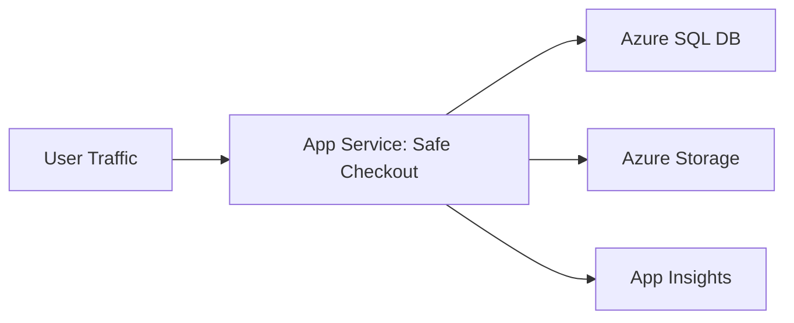
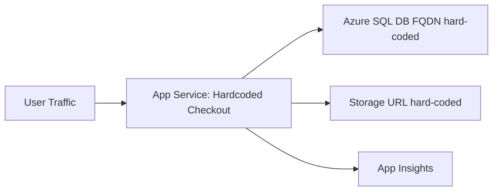
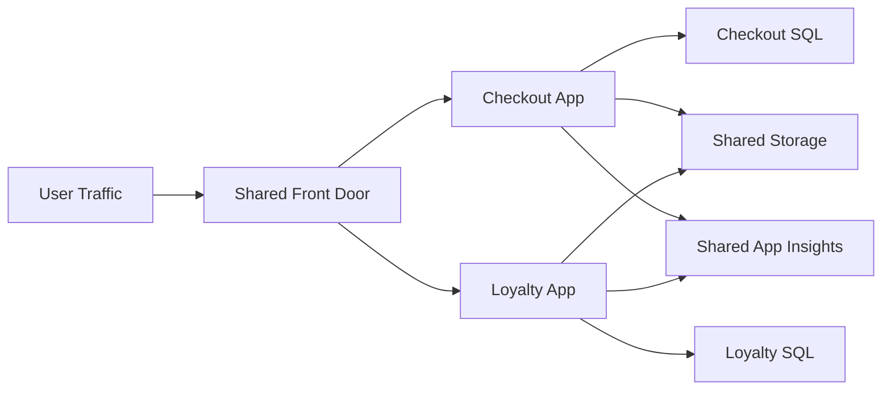
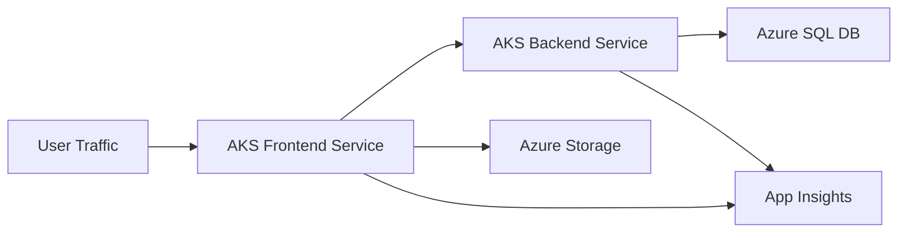
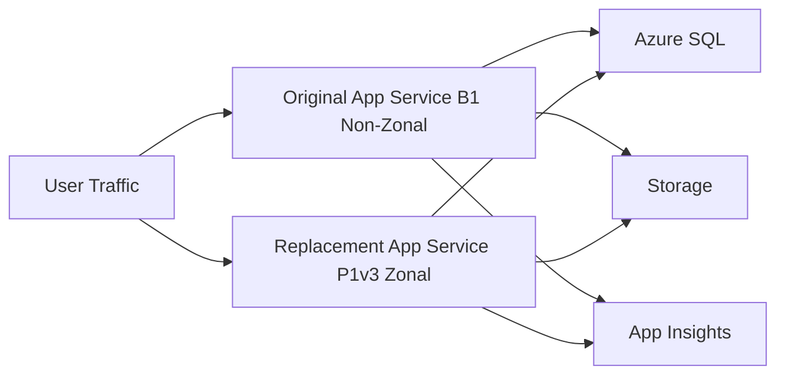

# Architecture Overview

This repository implements five migration risk scenarios for zonal resiliency analysis.

## Scenario 1 (Safe)

Notes:
- Dependencies configured via environment variables
- No hard-coded Azure endpoint literals

## Scenario 2 (Hard-coded)

Notes:
- Direct endpoint literals in source code
- High failure risk when resources are replaced

## Scenario 3 (Shared Infra)

Notes:
- Front Door and Storage are shared blast-radius resources

## Scenario 4 (AKS)

Notes:
- Dependency config in ConfigMaps/Secrets
- Runtime telemetry needed to validate actual use

## Scenario 5 (Replacement)

Notes:
- Plan replacement creates new hostname
- Downstream callers must be updated during cutover
